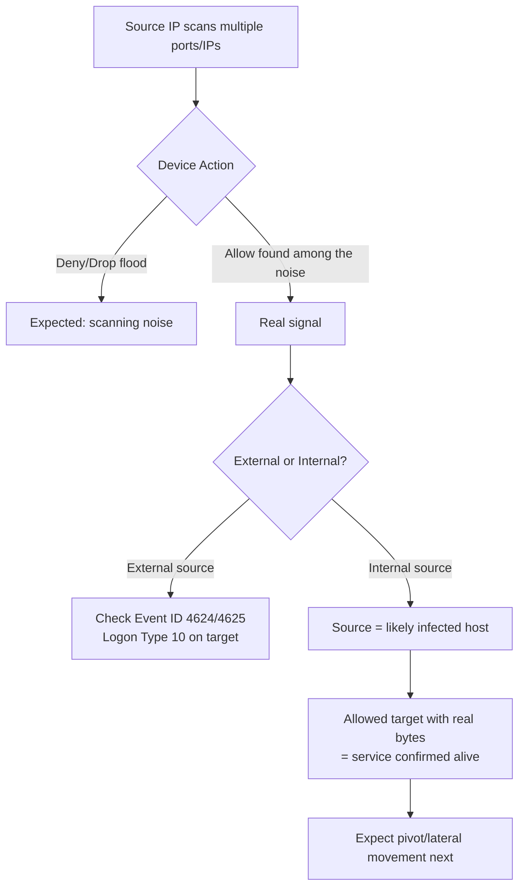

# using Firewall logs 

```mermaid
flowchart TD
    A[Source IP scans multiple ports/IPs] --> B{Device Action}
    B -->|Deny/Drop flood| C[Expected: scanning noise]
    B -->|Allow found among the noise| D[Real signal]
    D --> E{External or Internal?}
    E -->|External source| F[Check Event ID 4624/4625<br/>Logon Type 10 on target]
    E -->|Internal source| G[Source = likely infected host]
    G --> H[Allowed target with real bytes<br/>= service confirmed alive]
    H --> I[Expect pivot/lateral movement next]
```

