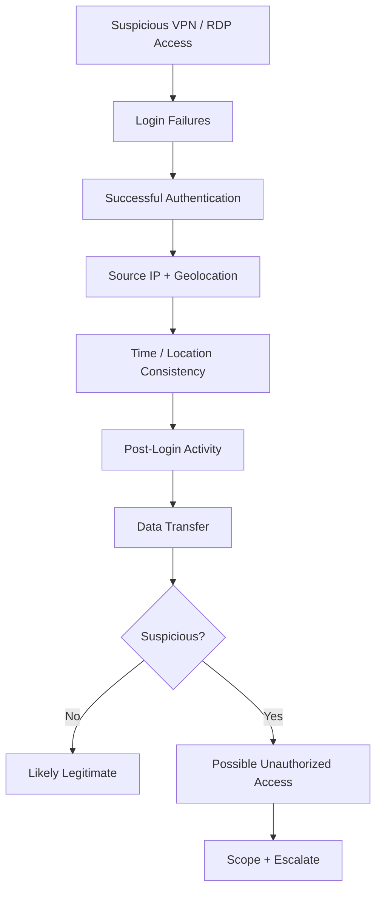
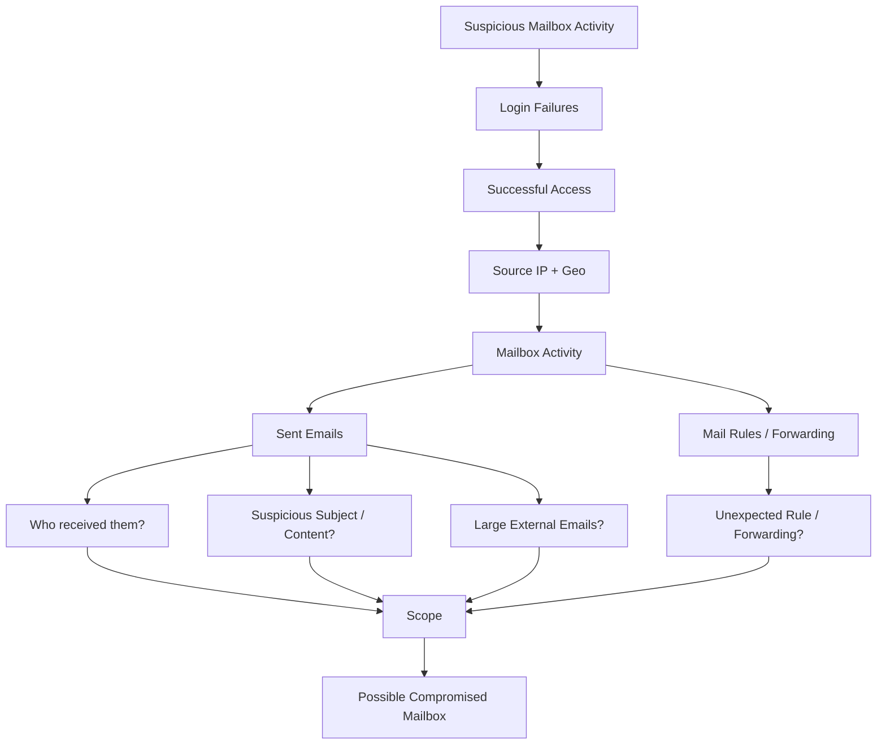
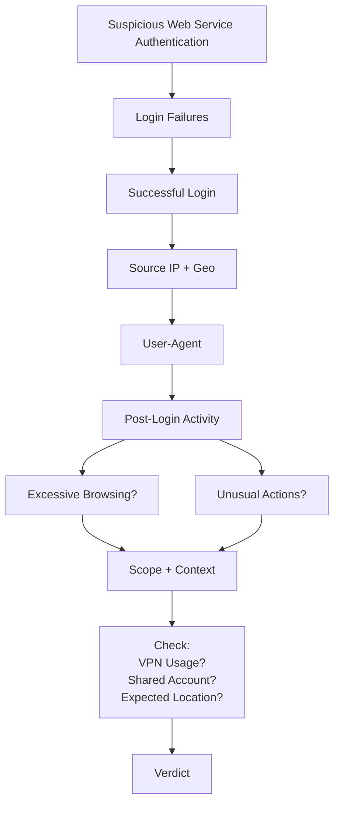
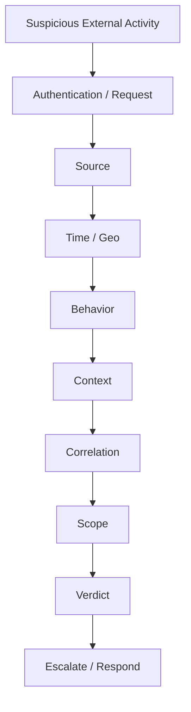

## Brute Force 

![[brute_forcing.png]]


## Phishing Attacks
![[ChatGPT Image Sep 10, 2026, 05_16_53 AM.png]]


## Unauthorized VPN / RDP Access

> **Was this remote access legitimate for this account, source, time, and behavior?**



### Investigate:
```
1. Multiple failed logins?
2. Successful login after failures?
3. Unexpected country/location?
4. Same account authenticated from two locations quickly?
5. Was large data transferred after VPN/RDP access?
6. What happened after login?
```

```
Failed Logins
     ↓
Successful Login
     ↓
Unusual Geo / Source
     ↓
Large Data Transfer
```


## Compromised Mailboxes

> **Is the mailbox being used by its legitimate owner?**



#### Mental shortcut
> **Authenticate → Geo → Mailbox Behavior → Scope**


## Suspicious Authentication to Web Services




1. Are there multiple login failures?
2. Is the successful login from an unexpected geo?
3. Are there two locations in a short timeframe?
4. Did the user-agent change?
5. Is there excessive browsing/activity after login?
6. Could the customer be using a VPN?
7. Is the account legitimately shared?


# The Common Methodology



#### WAF
```
Source → Request → WAF Decision → Behavior → Scope
```
#### VPN / RDP
```
Authentication → Source/Geo → Timing → Post-login Behavior → Scope
```
#### Mailbox
```
Authentication → Geo → Mail Activity → Rules/Recipients → Scope
```
#### Web Services
```
Authentication → Geo → User-Agent → Activity → Context → Scope
```

> **WHO accessed?**  
> **FROM WHERE?**  
> **WHEN?**  
> **WHAT did they access/do?**  
> **Was it normal for this account/source?**  
> **What happened after access?**  
> **Did the same behavior happen elsewhere?**

