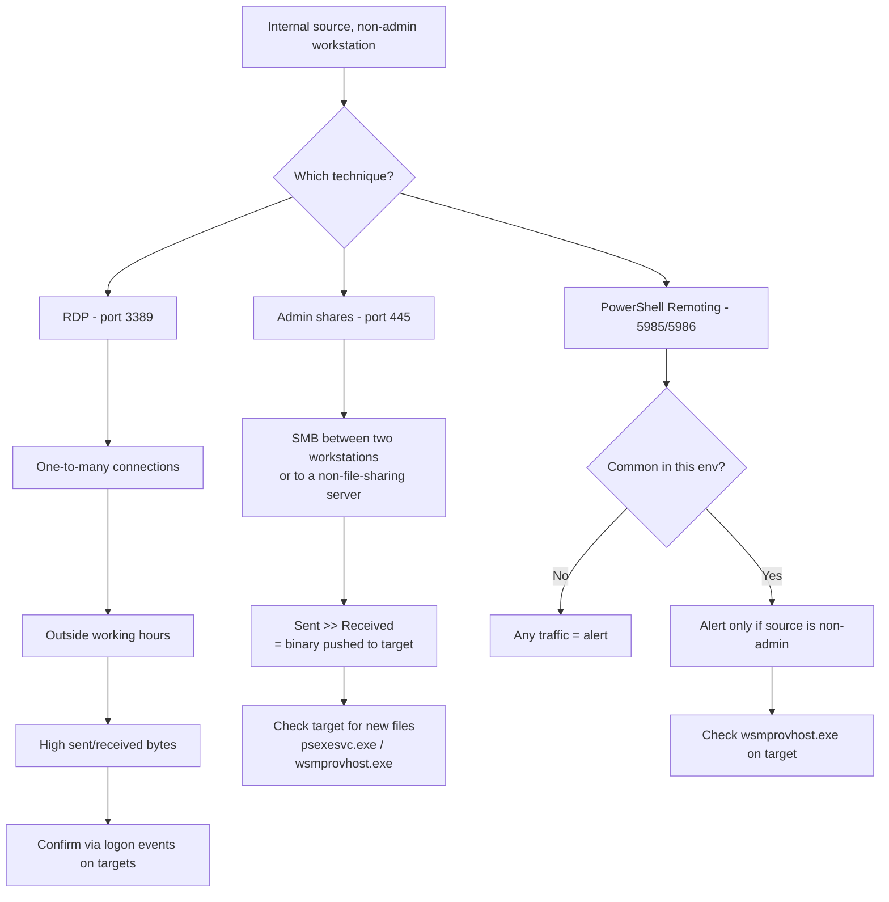
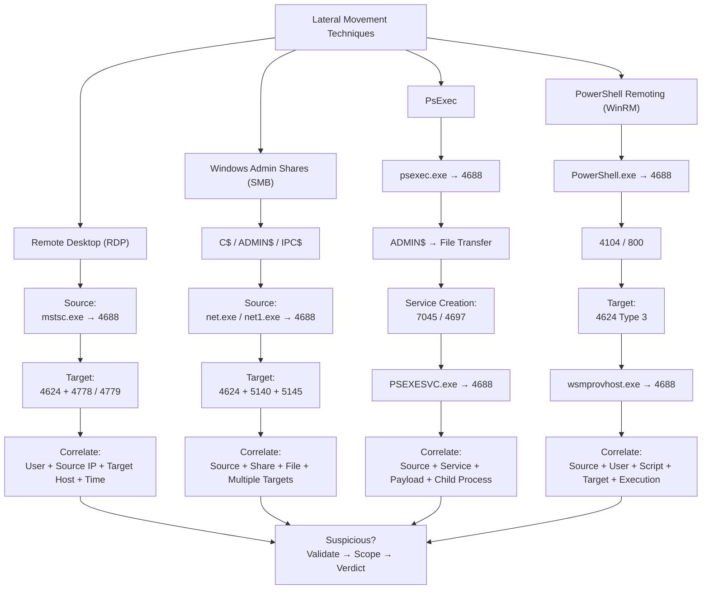

# Lateral Movement (RDP / Admin Shares / PS Remoting)

### using firewall logs

```mermaid
flowchart TD
    A[Internal source, non-admin workstation] --> B{Which technique?}

    B --> C[RDP - port 3389]
    C --> C1[One-to-many connections]
    C1 --> C2[Outside working hours]
    C2 --> C3[High sent/received bytes]
    C3 --> C4[Confirm via logon events on targets]

    B --> D[Admin shares - port 445]
    D --> D1[SMB between two workstations<br/>or to a non-file-sharing server]
    D1 --> D2[Sent >> Received<br/>= binary pushed to target]
    D2 --> D3[Check target for new files<br/>psexesvc.exe / wsmprovhost.exe]

    B --> E[PowerShell Remoting - 5985/5986]
    E --> E1{Common in this env?}
    E1 -->|No| E2[Any traffic = alert]
    E1 -->|Yes| E3[Alert only if source is non-admin]
    E3 --> E4[Check wsmprovhost.exe on target]
```

![[Pasted image 20260923150334.png]]

```mermaid
flowchart TD
    L["Lateral Movement Techniques"]

    L --> R["Remote Desktop (RDP)"]
    L --> A["Windows Admin Shares (SMB)"]
    L --> P["PsExec"]
    L --> W["PowerShell Remoting (WinRM)"]

    R --> R1["Source:<br/>mstsc.exe → 4688"]
    R1 --> R2["Target:<br/>4624 + 4778 / 4779"]
    R2 --> R3["Correlate:<br/>User + Source IP + Target Host + Time"]

    A --> A1["C$ / ADMIN$ / IPC$"]
    A1 --> A2["Source:<br/>net.exe / net1.exe → 4688"]
    A2 --> A3["Target:<br/>4624 + 5140 + 5145"]
    A3 --> A4["Correlate:<br/>Source + Share + File + Multiple Targets"]

    P --> P1["psexec.exe → 4688"]
    P1 --> P2["ADMIN$ → File Transfer"]
    P2 --> P3["Service Creation:<br/>7045 / 4697"]
    P3 --> P4["PSEXESVC.exe → 4688"]
    P4 --> P5["Correlate:<br/>Source + Service + Payload + Child Process"]

    W --> W1["PowerShell.exe → 4688"]
    W1 --> W2["4104 / 800"]
    W2 --> W3["Target:<br/>4624 Type 3"]
    W3 --> W4["wsmprovhost.exe → 4688"]
    W4 --> W5["Correlate:<br/>Source + User + Script + Target + Execution"]

    R3 --> D["Suspicious?<br/>Validate → Scope → Verdict"]
    A4 --> D
    P5 --> D
    W5 --> D
```

