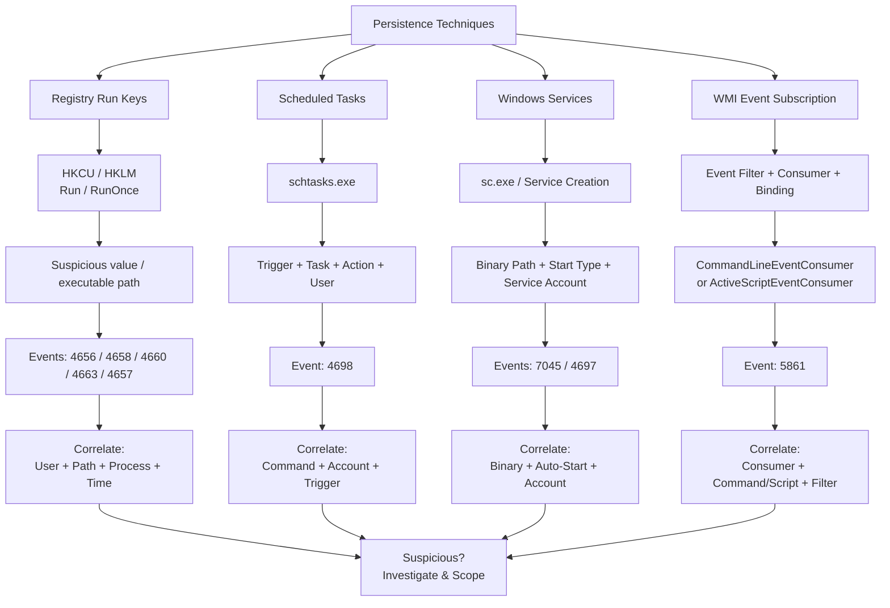

![[ChatGPT Image Sep 23, 2026, 02_57_16 PM.png]]

```mermaid
flowchart TD
    P["Persistence Techniques"]

    P --> R["Registry Run Keys"]
    P --> T["Scheduled Tasks"]
    P --> S["Windows Services"]
    P --> W["WMI Event Subscription"]

    R --> R1["HKCU / HKLM<br/>Run / RunOnce"]
    R1 --> R2["Suspicious value / executable path"]
    R2 --> R3["Events: 4656 / 4658 / 4660 / 4663 / 4657"]
    R3 --> R4["Correlate:<br/>User + Path + Process + Time"]

    T --> T1["schtasks.exe"]
    T1 --> T2["Trigger + Task + Action + User"]
    T2 --> T3["Event: 4698"]
    T3 --> T4["Correlate:<br/>Command + Account + Trigger"]

    S --> S1["sc.exe / Service Creation"]
    S1 --> S2["Binary Path + Start Type + Service Account"]
    S2 --> S3["Events: 7045 / 4697"]
    S3 --> S4["Correlate:<br/>Binary + Auto-Start + Account"]

    W --> W1["Event Filter + Consumer + Binding"]
    W1 --> W2["CommandLineEventConsumer<br/>or ActiveScriptEventConsumer"]
    W2 --> W3["Event: 5861"]
    W3 --> W4["Correlate:<br/>Consumer + Command/Script + Filter"]

    R4 --> D["Suspicious?<br/>Investigate & Scope"]
    T4 --> D
    S4 --> D
    W4 --> D
```

