# using firewall logs

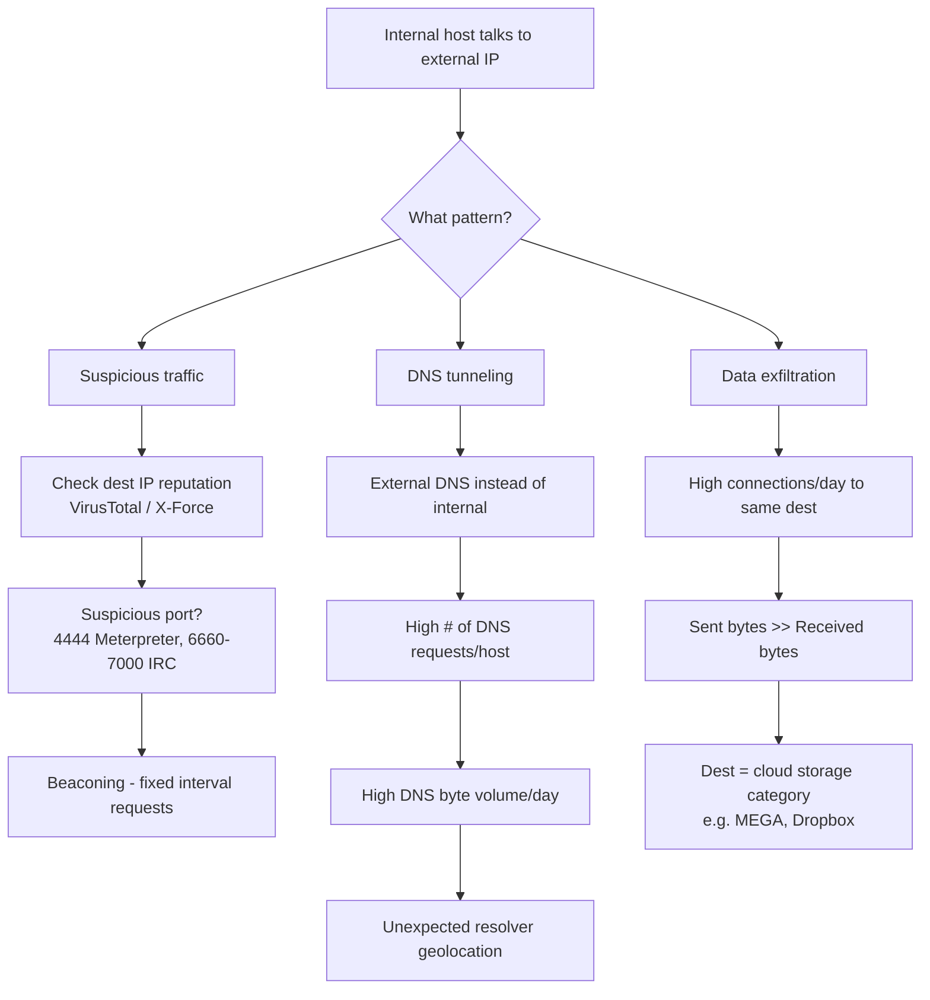


# using web proxy 

#### The mental model

When you receive:

```
Internal Host → Suspicious External Domain/IP
```

don't immediately conclude **C2**.

Build the story through:

```
Domain Reputation
        ↓
Target Domain Characteristics
        ↓
Requested Resource
        ↓
Referrer
        ↓
User-Agent
        ↓
Destination Port
        ↓
Bytes + HTTP Method + Content-Type
        ↓
C2 Communication Pattern
        ↓
Correlate Findings
        ↓
Verdict
```

The chapter explicitly divides the investigation into these areas.

---

#### Q1 — What is the domain reputation and category?

> - **Unknown ≠ malicious.**
> - **Reputation is a starting point, not the final verdict.**

Also check the proxy's own domain categorization.


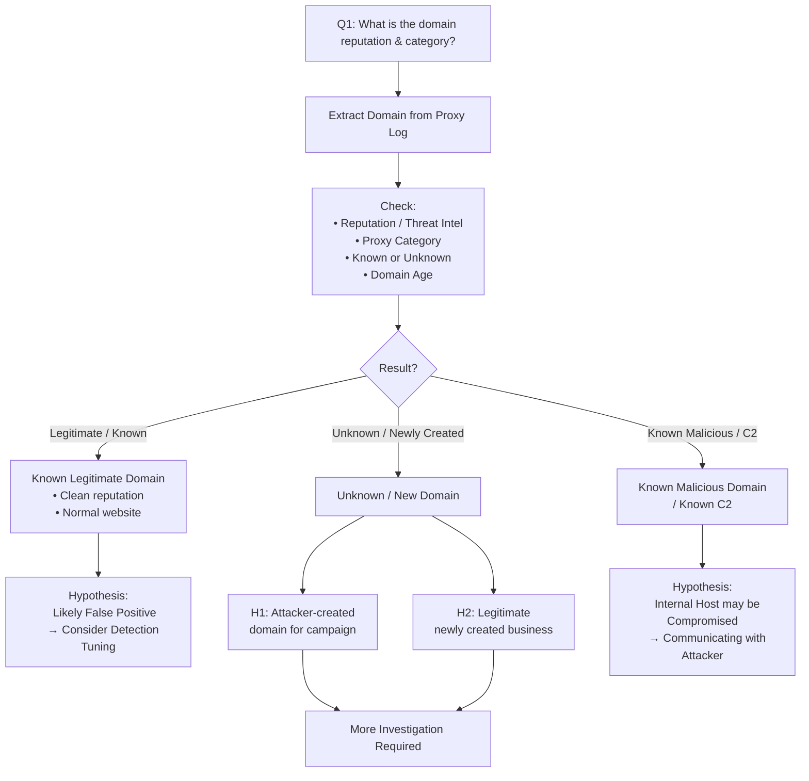


---

#### Q2 — What did we find when investigating the requested web resource?

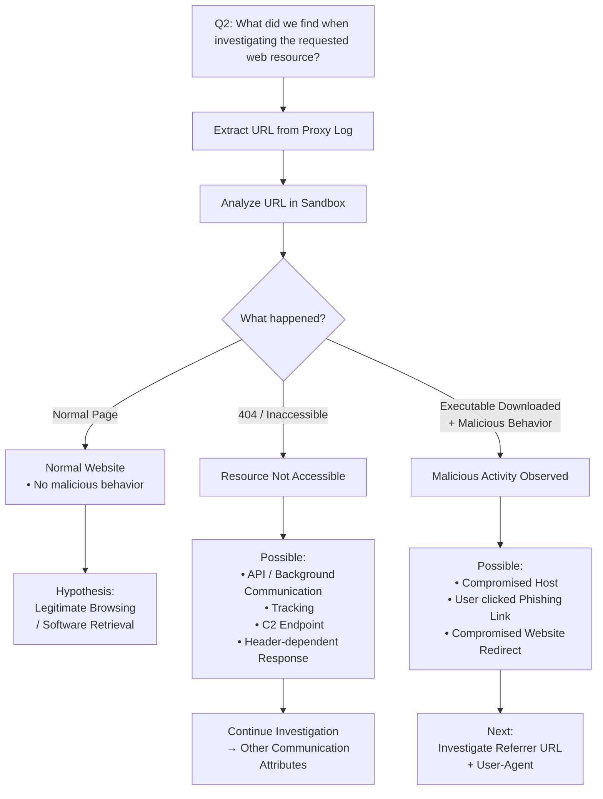


---

#### Q3 — Is there a referrer URL?

The purpose is:

> **How did the system reach the suspicious URL?**

##### Q4 — Did the source machine actually visit the referrer?

This is a **correlation check**.

Search the SIEM/proxy logs for:

> The suspected referrer URL as a **real requested URL** from the same source machine **before** the suspicious request.

##### Q5 — What is the referrer URL's behavior?

Run the suspected referrer in a sandbox and simulate normal browsing.


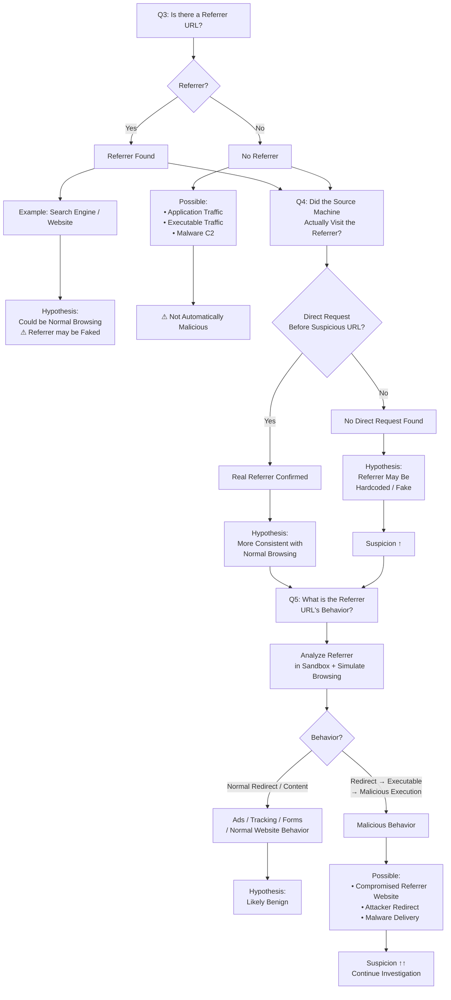

---

#### Q6 — What is the User-Agent?

Goal:

> Determine **what initiated the communication**.

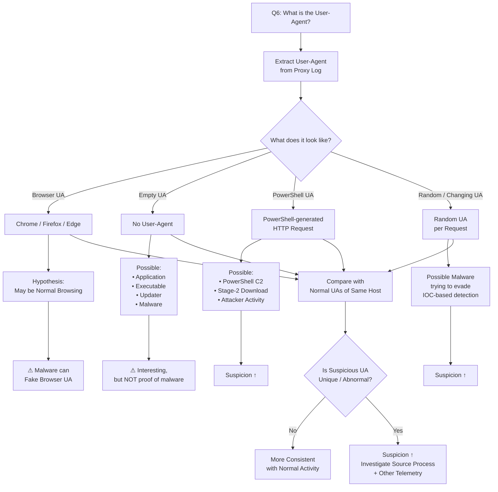


---


#### Q7 — What is the destination port?

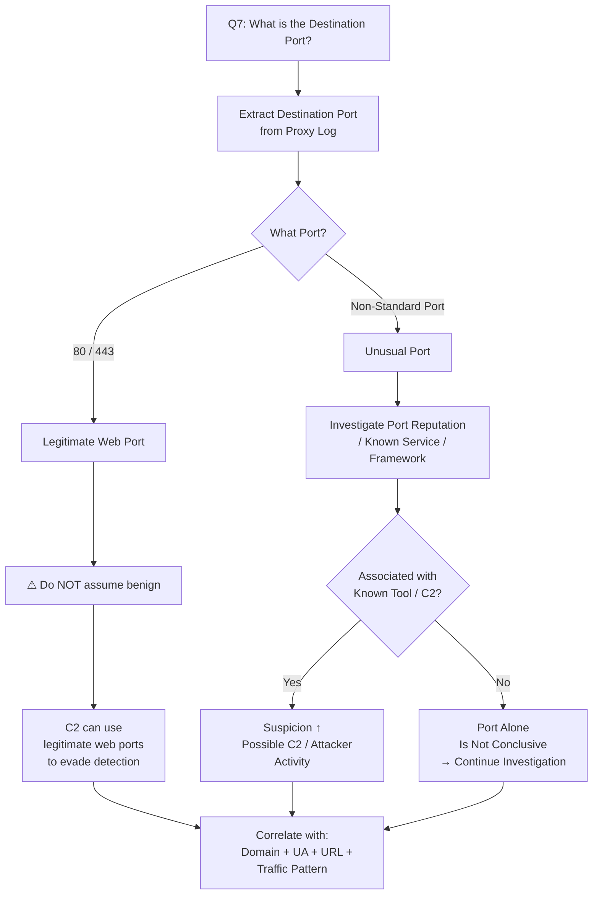


---

#### Q8 — What are the bytes, HTTP method, and Content-Type telling us?

This is where you start asking:

> **What is actually happening over the communication?**


The chapter also uses byte direction to reason about:

```
Sent high
→ possible upload / exfiltration

Received high
→ possible download / tools / malware
```

### Content-Type

Useful for understanding **what kind of content is moving**:

```
text/csv
application/msword
application/gzip
application/octet-stream
```

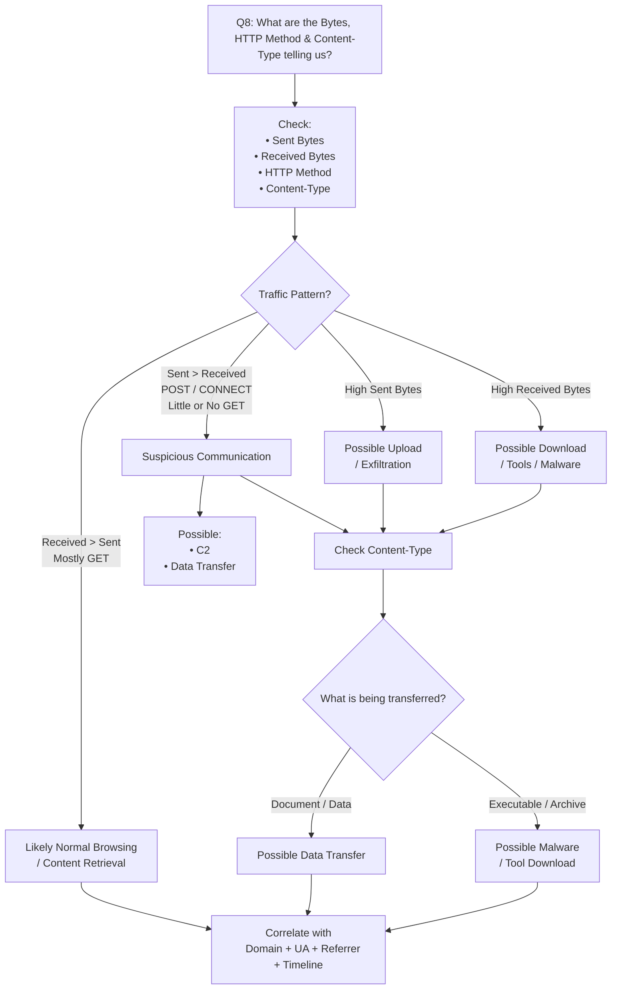


---


#### Q8 — What if the byte pattern changes over time?

This is especially important.

The chapter gives a behavioral narrative:

```
Initial small communications
        ↓
Small data collection/exfiltration
        ↓
Download additional tools
        ↓
Actual data exfiltration
```

This is an example of reconstructing **attacker activity from communication patterns**, rather than relying on one log.

---

#### 10. C2 Techniques to Look For
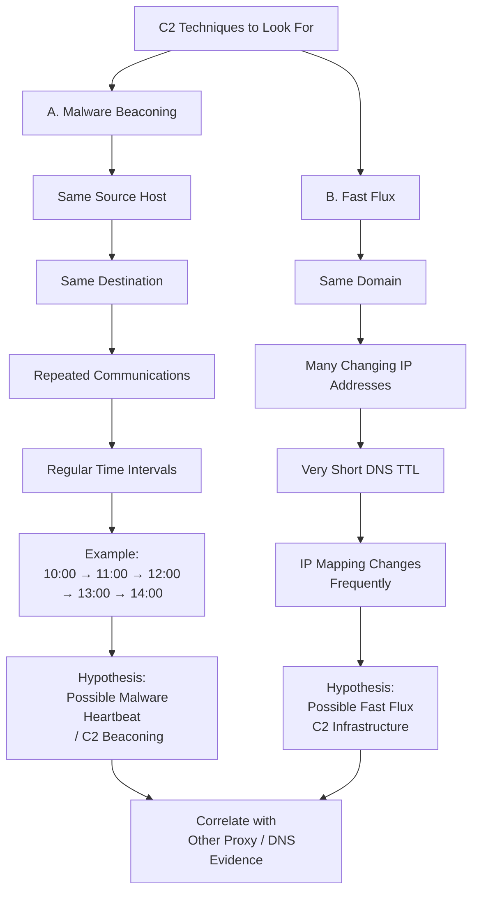


#### The Entire Investigation as a SOC Analyst

I'd reduce the whole chapter to this:

```
Suspicious Outbound Communication
            ↓
     WHO is the source?
            ↓
   WHAT domain/IP was contacted?
            ↓
     Reputation / Category
            ↓
     Is the domain suspicious?
            ↓
       What URL/resource?
            ↓
     What happened there?
            ↓
       Referrer?
            ↓
  Did the host really visit it?
            ↓
      User-Agent?
            ↓
What process/application may have generated it?
            ↓
      Destination Port?
            ↓
     Bytes / Methods / Content-Type
            ↓
      What was transferred?
            ↓
   Is there a communication pattern?
            ↓
      Beaconing / Fast Flux?
            ↓
         CORRELATE
            ↓
      SCOPE THE HOST
            ↓
         VERDICT
```

---

####  Detection: What Makes C2 More Convincing?

**No single indicator is enough.**

The strongest investigation happens when several independent observations line up:

```
Rare / suspicious domain
+
Unusual domain age
+
Suspicious URL
+
No genuine browsing/referrer history
+
Non-browser / PowerShell User-Agent
+
Repeated periodic communication
+
POST / CONNECT pattern
+
Outbound bytes > expected
+
Additional malware/tool download
```

The chapter's final message is explicitly to **correlate the findings from all these stages to determine the final classification**.

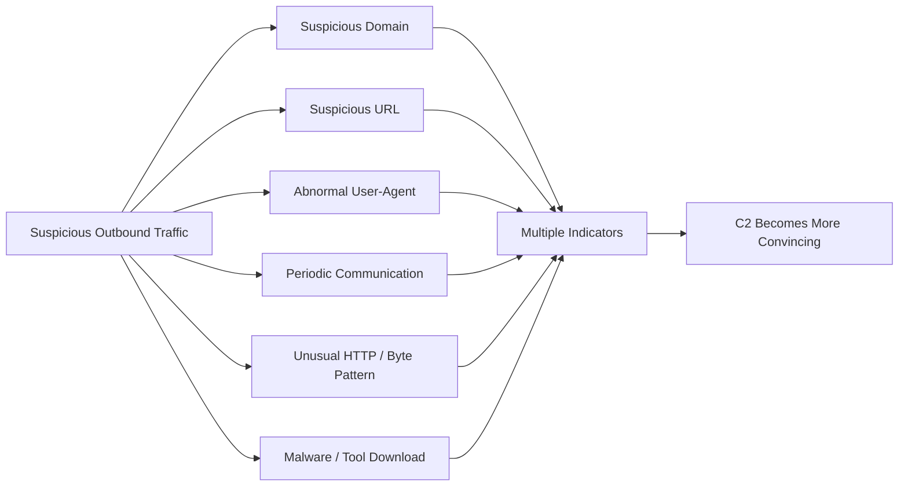


---


### Response 

1. **Determine severity**: 
	- did the connection succeed or get blocked (action/status)? 
	- How many bytes moved, and in which direction?
2. **Containment**: 
	- isolate the src host, and block on the proxy/DNS by **Domain/FQDN, not just IP** 
	  (especially with Fast Flux and DDNS), plus the URL and the UA if it's unique.
3. **Scope**: 
	- search proxy/DNS logs for the same 
		- domain/IP/URL/UA/beaconing pattern from any other src.
4. **Endpoint**: 
	- the proxy won't tell you which process sent the traffic. 
	- Pull the responsible process from EDR, 
	- plus the persistence (like the ASEP registry keys seen in the sandbox), and 
	- preserve evidence (memory/disk) before any rebuild.
5. **Data loss**: 
	- use the byte phases from Q8 to determine what leaked (timing, volume, type), and confirm from the endpoint.
6. **Credentials**: 
	- review the `username` in the logs, and 
	- reset the account if the machine was under attacker control.
7. **Eradication + Tuning**: 
	- rebuild/cleanup, 
	- add the IOCs, and 
	- build Detection Use Cases (DDNS list, UA mismatch, beaconing, sent>received). 
	- If it was an FP, exclude the domain precisely.


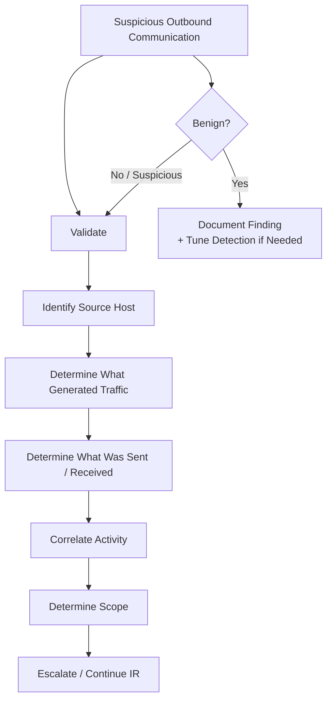


#### Investigation Mindset (Combinations)

A single field rarely tells you anything. The **combination** is what reveals the attack:

| Scenario                    | Signals together                                                                                              |
| --------------------------- | ------------------------------------------------------------------------------------------------------------- |
| **Malware / tool download** | GET + high sc-bytes + executable Content-Type + <br>status 2xx + action allowed                               |
| **Exfiltration**            | POST/PUT + high cs-bytes + external or cloud-storage destination                                              |
| **C2**                      | No Referer + odd/non-browser User-Agent + <br>new or DGA domain + unusual port                                |
| **Phishing**                | URL with a typo/unusual extension + 3xx chain + <br>login page. From the logs you can identify who visited it |
| **Stolen credentials**      | username doesn't match the machine's owner                                                                    |
| **Insider**                 | Many requests to restricted resources, hacking-tool downloads, bypass attempts                                |


# Investigating WAF Logs

**WHO?**
- Source IP / Geo
**WHAT?**
- URL / Request / Violation Type / Matched Signature
**WHERE?**
- Destination IP / Target Application
**HOW?**
- HTTP Method / User-Agent / Request Pattern
**WHAT HAPPENED AFTER?**
- Allowed? Blocked? Web Shell? Exfiltration? Internal connection?

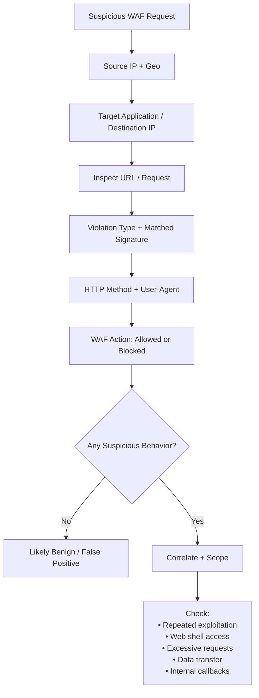


