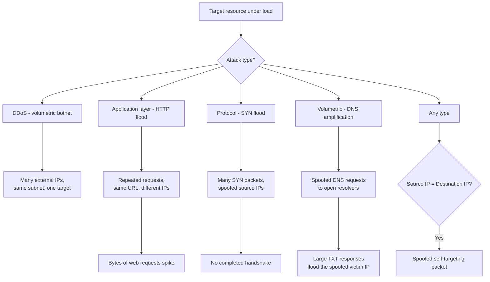

## using firewall logs

```mermaid
flowchart TD
    A[Target resource under load] --> B{Attack type?}

    B --> C[DDoS - volumetric botnet]
    C --> C1[Many external IPs,<br/>same subnet, one target]

    B --> D[Application layer - HTTP flood]
    D --> D1[Repeated requests,<br/>same URL, different IPs]
    D1 --> D2[Bytes of web requests spike]

    B --> E[Protocol - SYN flood]
    E --> E1[Many SYN packets,<br/>spoofed source IPs]
    E1 --> E2[No completed handshake]

    B --> F[Volumetric - DNS amplification]
    F --> F1[Spoofed DNS requests<br/>to open resolvers]
    F1 --> F2[Large TXT responses<br/>flood the spoofed victim IP]

    B --> G[Any type]
    G --> G1{Source IP = Destination IP?}
    G1 -->|Yes| G2[Spoofed self-targeting packet]
```

