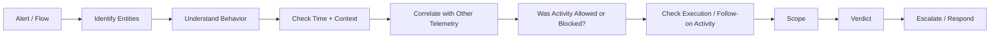
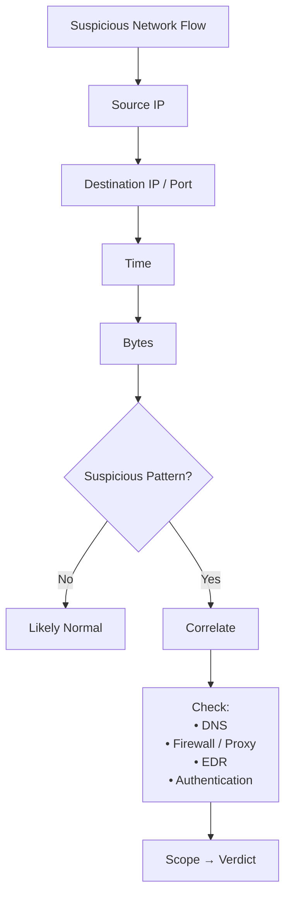
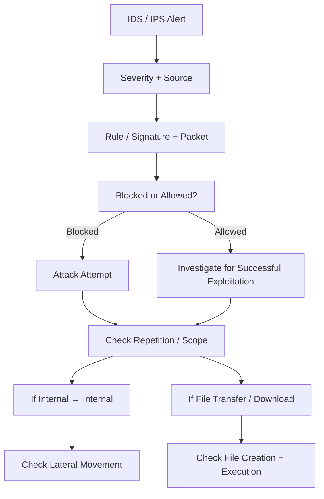
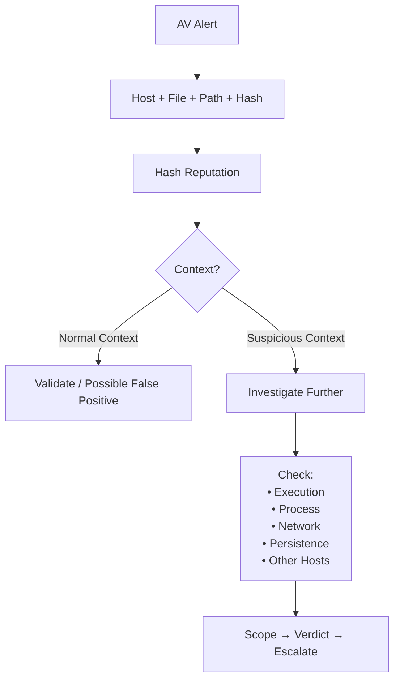
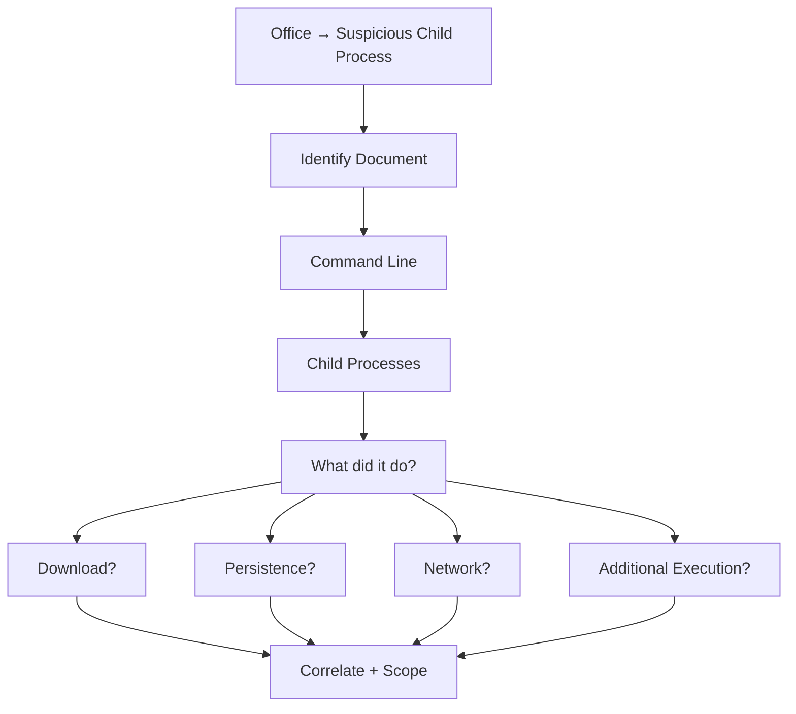
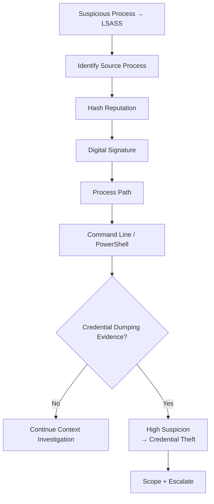
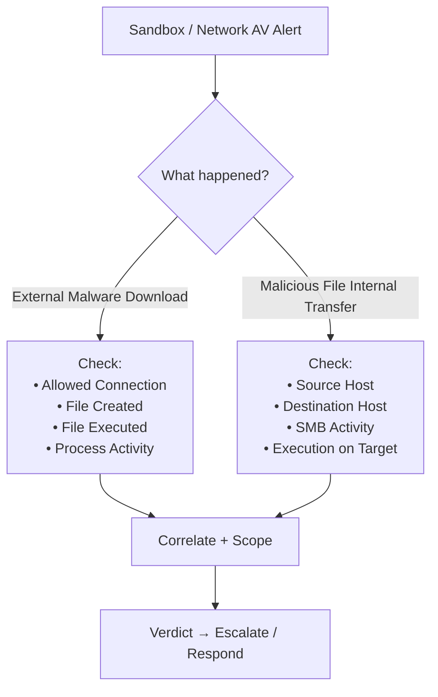

# The Common Investigation Pattern


### NetFlow
> **Who talked to whom, when, over what port, and how much?**
### IDS/IPS
> **What triggered the rule, was it blocked, and did the attack succeed anyway?**
### AV
> **What file was detected, where is it, what is it, and did it execute/spread?**
### EDR
> **What process did what, who spawned it, and what happened next?**
### Sandbox
> **What was downloaded/transferred, and what happened after that?**


## Network Flows / NetFlow

**Investigate the NetFlow to detect:** 
- Blacklisted IP communication
- Suspicious ports
- High byte transfer
- Outbound communication at unusual times

### Investigation mindset




## IDS / IPS Alerts

> **Don't trust the alert alone; investigate the packet/rule and what happened after it.**




## AV Alerts

> **Is the detected file actually malicious?**

**AV Containing:** 
- Host
- Filename
- Path
- Hash
- Malware Name
- Category

```
Malware on critical/high-value host
Hacking tool on non-admin workstation
Malware in TEMP / user profile
Malware in remote share
Legitimate Windows name in abnormal path
Same malware on many hosts
Ransomware / InfoStealer / RAT / Web Shell
```



## EDR

#### Office → Suspicious Process
### Investigation
```
Which Office document?
What command line?
What child process?
What did the child process do?
Did it download anything?
Did it create persistence?
Did it communicate externally?
```




#### Suspicious LSASS Access
> **Who accessed LSASS, and is that source process trustworthy?**

check: 
```
Source process hash
Digital signature
Process path
PowerShell command/script
```




## Network Sandbox / Network AV
#### A. External download
```mathematica
External Server
      ↓
Internal Host
      ↓
Malicious File
```

- attacker stage-two download
- user tricked by phishing
- compromised website redirect


> **Was the file actually downloaded and executed?**

#### B. Internal file transfer
```mathematica
Host A
  ↓ SMB
Host B
```




## Response / IR Mindset

```mathematica 
Validate
   ↓
Identify affected host/user
   ↓
Determine successful compromise
   ↓
Scope
   ↓
Preserve relevant evidence
   ↓
Escalate / Contain according to IR procedure
```

```mathematica 
IPS Blocked
→ Attempt

IPS Alert + Allowed Traffic
→ Investigate Success

AV Detection
→ Determine execution / spread

EDR Alert
→ Reconstruct process behavior

Network Download
→ Check file creation + execution
```

